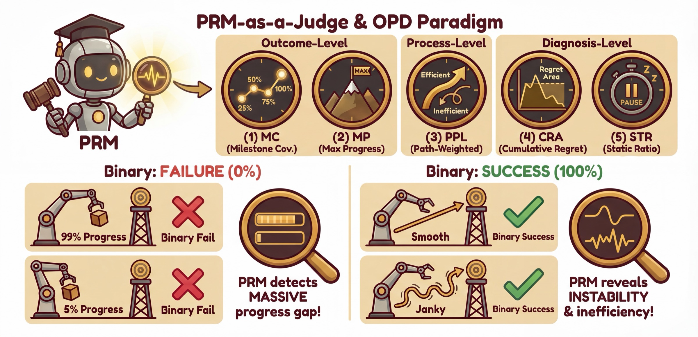
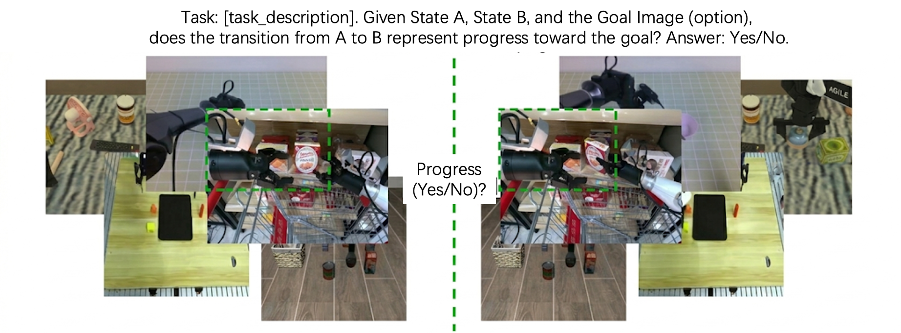
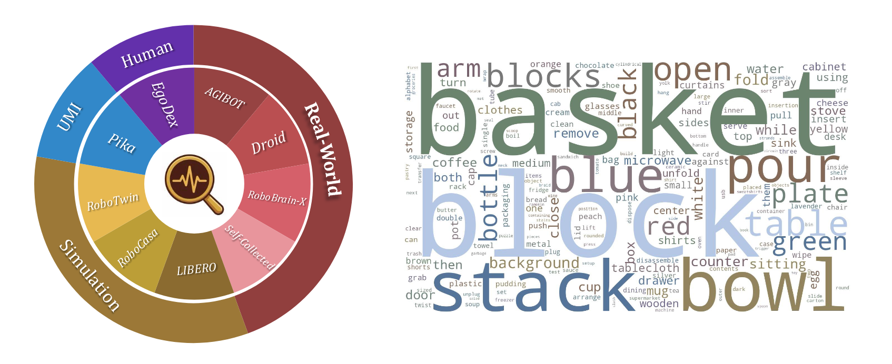
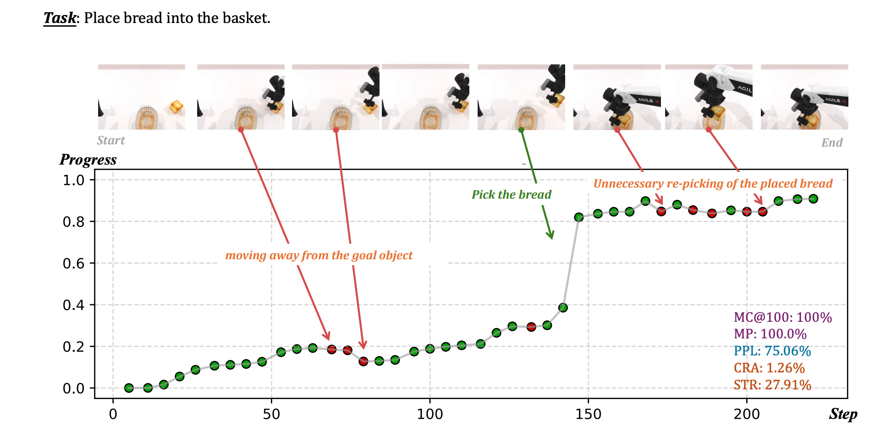
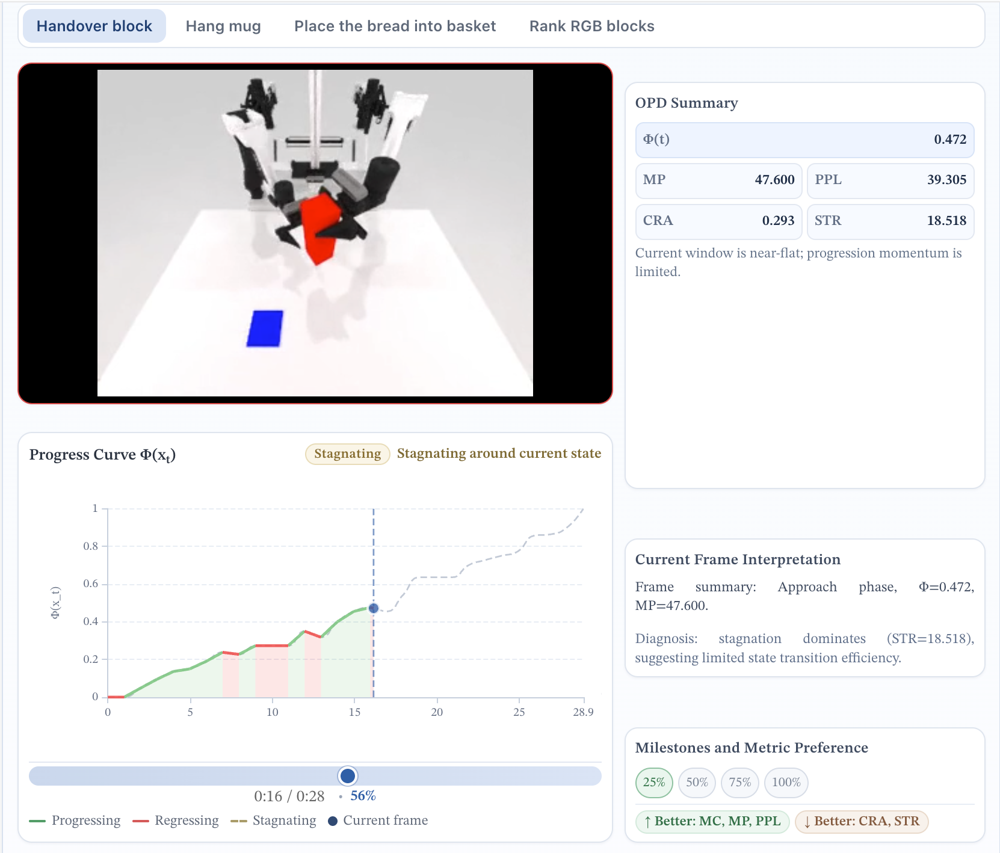
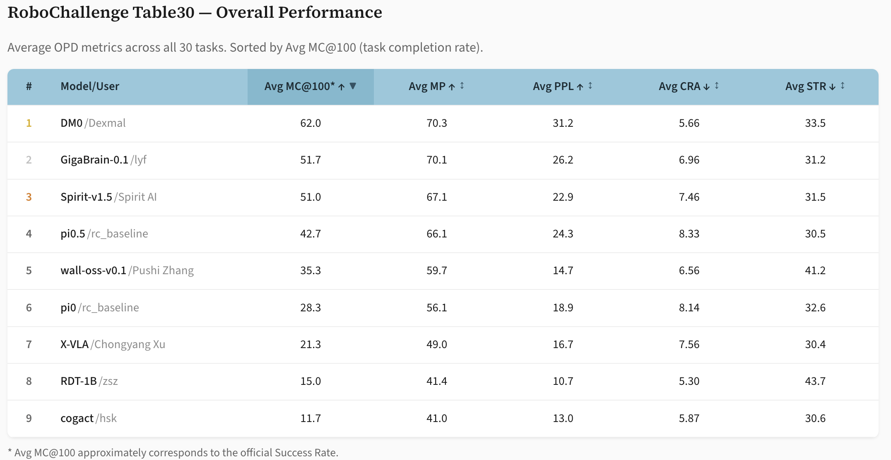

<h1 align="center">
  
  PRM-as-a-Judge: A Dense Evaluation Paradigm for Fine-Grained Robotic Auditing
</h1>

<h3 align="center">Beyond pass/fail, toward process-level robot evaluation.</h3>

<p align="center">
  <a href="https://arxiv.org/abs/2603.21669"></a>
  &nbsp;
  <a href="https://prm-as-a-judge.github.io/"></a>
  &nbsp;
  <a href="https://prm-as-a-judge.github.io/blog.html"></a>
  &nbsp;
  <a href="https://prm-as-a-judge.github.io/leaderboard.html"></a>
  &nbsp;
  <a href="https://huggingface.co/datasets/yuheng2000/RoboPulse"></a>
  &nbsp;
  <a href="https://huggingface.co/tanhuajie2001/Robo-Dopamine-GRM-2.0-8B-Preview"></a>
  &nbsp;
  <a href="LICENSE"></a>
</p>

<p align="center">
  
</p>

## 🔥 Updates

- **`2026-03-30`**: 🔥 The [RoboPulse benchmark page](https://huggingface.co/datasets/yuheng2000/RoboPulse) is now online on Hugging Face.
- **`2026-03-27`**: 🔥 PRM-as-a-Judge evaluation with PRM backends is now open in this repo. Start with [Robo-Dopamine](https://huggingface.co/tanhuajie2001/Robo-Dopamine-GRM-2.0-8B-Preview) and try it on your own rollouts.
- **`2026-03-23`**: 🔥 PRM-as-a-Judge blog and arXiv paper are released. See methodology, OPD definitions, and demos in the [technical blog](https://prm-as-a-judge.github.io/blog.html).
- **`2026-03-20`**: 🔥 RoboChallenge Table30 leaderboard results are released on the [leaderboard page](https://prm-as-a-judge.github.io/leaderboard.html).

## Why Fine-Grained Robotic Auditing?

Binary success rate creates two blind spots:

- `99%` progress and `5%` progress can both become the same `failure`.
- Smooth success and janky success can both become the same `success`.

PRM-as-a-Judge addresses exactly this problem: instead of reducing a rollout to one final bit, it audits how far the policy got, how it moved, and where it broke down.

## OPD: Three-Tier Signals

PRM-as-a-Judge deconstructs a single execution into OPD signals:

- **Outcome**: `MC`, `MP` measure how far the rollout got.
- **Process**: `PPL` measures how efficiently the rollout moved.
- **Diagnosis**: `CRA`, `STR` expose regressions and stagnation patterns.

## What Makes a Model a Qualified Judge?

A valid dense evaluator should satisfy two properties simultaneously: **macro-consistency** for additive, path-independent aggregation, and **micro-resolution** for distinguishing fine-grained task-relevant state changes. Under this formulation, potential-based PRM judges naturally support macro-consistency, while [**RoboPulse**](https://huggingface.co/datasets/yuheng2000/RoboPulse) is introduced to empirically verify whether a judge truly has microscopic progress resolution.

<table>
  <tr>
    <td width="50%"></td>
    <td width="50%"></td>
  </tr>
</table>

## Auditing with PRM-as-a-Judge

Once a judge has both macro and micro resolution, PRM-as-a-Judge can turn a rollout into interpretable auditing signals.

In the example below, the rollout eventually succeeds, but the progress curve reveals two early detours away from the goal object and a later unnecessary re-pick after placement. Binary success rate would hide all three. OPD makes them visible.

<p align="center">
  
</p>

Want to inspect trajectories frame by frame? The blog includes an interactive explorer with progress curves, metric summaries, and frame-level interpretations: [https://prm-as-a-judge.github.io/blog.html#interactive-trajectory-explorer](https://prm-as-a-judge.github.io/blog.html#interactive-trajectory-explorer)

<p align="center">
  <a href="https://prm-as-a-judge.github.io/blog.html#interactive-trajectory-explorer">
    
  </a>
</p>

## Leaderboard Snapshot

The online leaderboard contains the full RoboChallenge Table30 results, sortable metrics, and per-task views: [https://prm-as-a-judge.github.io/leaderboard.html](https://prm-as-a-judge.github.io/leaderboard.html)

<p align="center">
  <a href="https://prm-as-a-judge.github.io/leaderboard.html">
    
  </a>
</p>

Three quick takeaways stand out:

1. **DM0 is not only a finisher.** It leads Avg MC@100 (`62.0`), Avg MP (`70.3`), and Avg PPL (`31.2`), so its advantage comes from both deeper reachability and stronger execution efficiency.
2. **GigaBrain-0.1 shows a last-mile gap.** Its Avg MP is almost identical to DM0 (`70.1` vs. `70.3`), but its Avg MC@100 is much lower (`51.7` vs. `62.0`), suggesting that it often gets near the goal state without converting that progress into full completion.
3. **Diagnostic metrics must be read together with reachability.** RDT-1B has the lowest Avg CRA (`5.3`) despite only `15.0` Avg MC@100, while wall-oss-v0.1 still reaches Avg MP `59.7` but has a high Avg STR of `41.2`. Low regret or moderate progress alone does not imply smooth, strong execution.

## Evaluate Your Own Rollouts

The repo already includes demo cases in `eval/videos/demo_cases`. You can use the same pipeline to audit your own rollout videos.

1. Choose a PRM backend. For now, we recommend [Robo-Dopamine (GRM-2.0-8B-Preview)](https://huggingface.co/tanhuajie2001/Robo-Dopamine-GRM-2.0-8B-Preview) as a strong default choice. Under the unified rollout format used in this repo, it is suitable for mainstream robotics benchmarks such as LIBERO, SimplerEnv, RoboCasa, and RoboTwin, as well as most real-robot evaluation tasks.
2. Put your rollout folders under `eval/videos` using the same layout as `eval/videos/demo_cases`. Each sample only needs matching `*_high.mp4`, `*_left.mp4`, and `*_right.mp4` files.
3. Add task prompts in `eval/tasks/<benchmark>.json`. Goal images are optional. If you provide them, place one image under `eval/goals/<benchmark>/<task>/`.
4. Run evaluation:

```bash
PRM_PATH=/path/to/your-prm-checkpoint bash eval/run_eval.sh
```

If you prefer to call the runner directly:

```bash
python eval/run_judge.py \
  --benchmark demo_cases \
  --eval-mode backward \
  --visualize \
  --prm-path /path/to/your-prm-checkpoint
```

Outputs are written to `eval/results/run_*/`.

We also welcome community PRs for stronger PRM backends, new benchmark adapters, and cleaner rollout loaders.

## TODO

- [x] Release project homepage, blog, and leaderboard.
- [x] Release RoboChallenge Table30 OPD results on the online leaderboard.
- [ ] Release a detailed analysis report for the RoboChallenge Table30 benchmark.
- [ ] Release evaluator inference toolkit for offline trajectory scoring.
- [ ] Release standardized RoboPulse access and evaluation protocol.

## Citation

If this project, leaderboard, or evaluation pipeline helps your work, please cite:

```bibtex
@article{ji2026prmjudge,
  title   = {PRM-as-a-Judge: A Dense Evaluation Paradigm for Fine-Grained Robotic Auditing},
  author  = {Ji, Yuheng and Liu, Yuyang and Tan, Huajie and Huang, Xuchuan and Huang, Fanding and Xu, Yijie and Chi, Cheng and Zhao, Yuting and Lyu, Huaihai and Co, Peterson and others},
  journal = {arXiv preprint arXiv:2603.21669},
  year    = {2026}
}
```

## Collaboration and Open Evaluation

We welcome collaboration with benchmark teams and model developers. If you can share rollout videos, we are happy to audit them with OPD and help build a more transparent robotics evaluation stack. We especially encourage leaderboard submissions to release inspectable rollout evidence whenever possible, so results are reproducible, diagnosable, and more useful to the community. Contact: `jiyuheng2023@ia.ac.cn`
